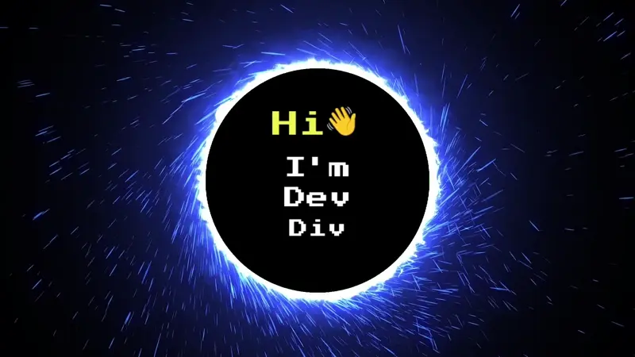

  

Icons by [https://icons8.com](https://icons8.com)

- 🔭 I’m currently working on an inline-text unit converter and a new student-oriented tool for my website.
- 🌱 I’m currently learning React.
- ⚡ Fun fact: In addition to gaming and tech, I'm also a pop culture fan. Are you pumped for Deadpool and Wolverine?

## 💻 Skill Set

  

## 🏆 Stats

    
    

## 🎮 When I'm AFK

  

